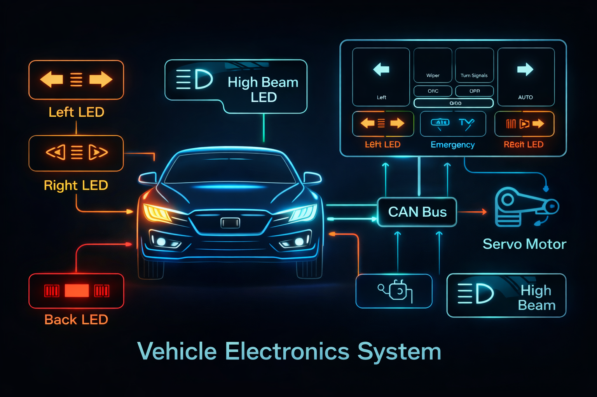
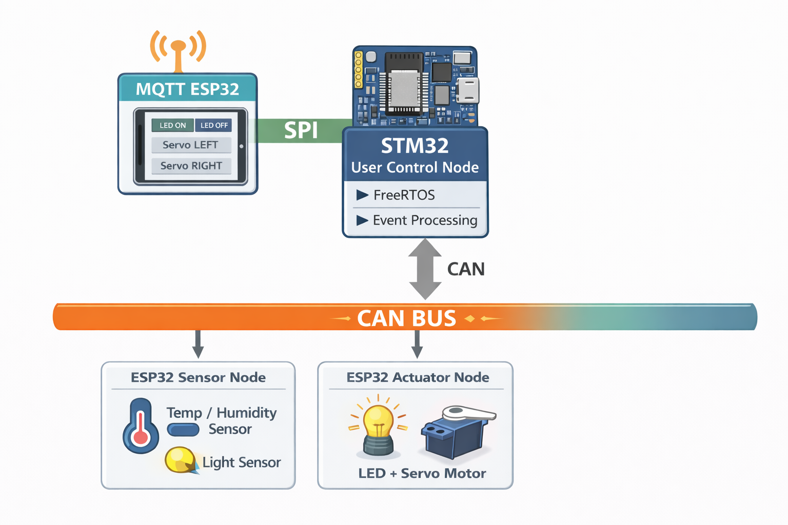
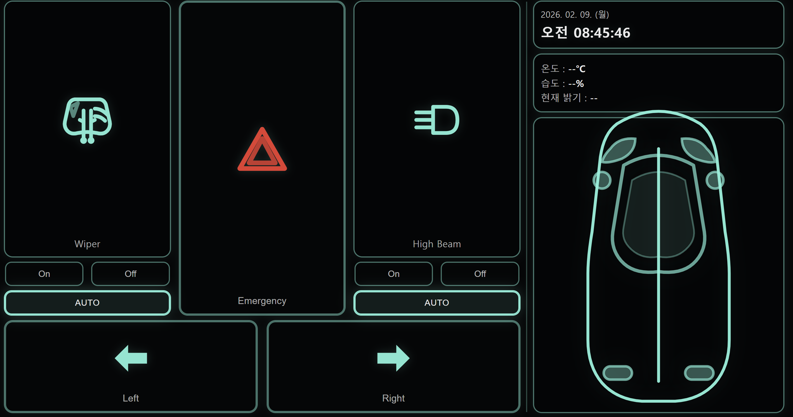

# **📜** 개요

---

# 프로젝트 명 : DFS(Drive Fusion System)

### ⇒ CAN 네트워크 기반 전장 제어로 효율적으로 제어하고, 직관적인 인터페이스를 제공하는 차량 제어 플랫폼 설계

# 📋 Architecture

---

### CAN

- 2개의 ESP32 ↔ STM32 통신을 효율적으로 구축하기 위해 사용
    - FreeRTOS를 통해 중요한 데이터가 먼저 전송되도록 하여 실시간 성능을 보장
    - 물리적 결함에 강한 네트워크 구조를 가지고 있어, 일부 노드의 장애가 전체 네트워크에 영향을 주지 않음
    - BUS를 기반으로, 각 장치가 고유한 메시지 ID를 사용하여 통신하기 때문에 시스템 확장이 용이함

### **MQTT**

- 와이파이 환경을 위한 무선 통신 연결을 위해 사용
    - 외부 서버에 접근 후 인터넷을 활용해 UI/UX를 출력
    - 전송하는 데이터는 Flag 신호이므로 가벼운 MQTT 프로토콜 사용

### **SPI**

- 신뢰성과 전송 속도가 빠른 유선 통신 프로토콜 사용

### Operation Policy

- 개발 통합 정책을 설정하고, 이를 통해 통신 프로토콜, 보안, 로그 등을 통일

# 📃 Specification

---

1. **센서**
    - DHT11 및 CDS 센서 값 Read 후 CAN 통신을 통해 STM32에 전송
2. **통신**
    - STM32로부터 센서 데이터를 받아 SPI 통신을 통해 MQTT ESP32에 데이터 전송
    - HTML을 외부 Web Server에다 구축하고 개인 토픽 설정
    - 웹에서의 요청에 따라 MQTT ESP32 → STM32으로 SPI 통신을 통해 명령 전송
3. **사용자 UI**
    - HTML을 활용한UI/UX 기반의 원격 제어 설계
    - 실시간으로 측정된 센서 값을 UI에 표시
4. **제어**
    - 수동 제어 : MQTT ESP32의 차량 제어 명령에 따라 우선적인 차량 구동 제어
    - 자동 제어 : 실시간 센서 데이터에 따라 상향등, 와이퍼 제어 기능

### ※ UI/UX

