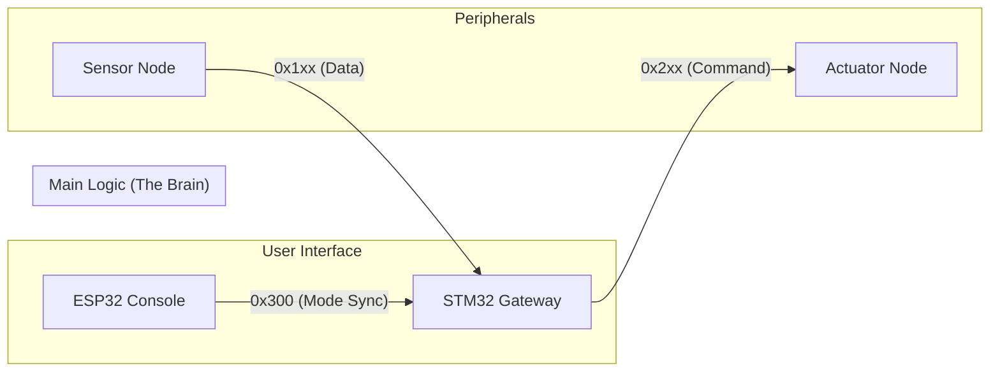

# 🚗 ISO 26262 기반 STM32-ESP32 차량 제어 시스템 (v2.1)

본 프로젝트는 STM32(FreeRTOS) 게이트웨이를 중심으로 ESP32 노드들이 CAN 통신을 통해 유기적으로 결합된 하드웨어 제어 시스템입니다. 기능 안전(ISO 26262) 철학을 반영하여 데이터 무결성과 역할 분담이 철저히 설계되었습니다.

---

## 🏗️ 시스템 아키텍처 (Console-Gateway Structure)

본 시스템은 **"생각하는 뇌(Gateway)"**와 **"화면을 보여주는 UI(Console)"**를 분리한 현대적인 전장 아키텍처를 따릅니다.



### 1. 주요 노드별 역할
| 노드명 | 핵심 파일 | 설명 |
|:---:|:---|:---|
| **Gateway (STM32)** | `freertos.c`, `decision.h` | **시스템 사령탑**. 센서 데이터를 검증하고 실시간(RTOS)으로 제어 명령을 하달함. |
| **Console (ESP32)** | `mqtt.c` | **사용자 접점**. 웹 대시보드를 제공하며 사용자의 설정 모드를 게이트웨이와 동기화함. |
| **Sensor (ESP32)** | `send.c` | 온습도/조도 값을 수집하여 안전 프레임(CRC8 포함)으로 전송함. |
| **Actuator (ESP32)** | `control.c` | 게이트웨이의 명령을 받아 와이퍼/전조등을 실제로 구동하고 피드백을 보고함. |

---

## 🛡️ 핵심 기술 및 안전 장치

### 1. E2E-lite Frame Structure (B0 ~ B7)
모든 통신은 아래의 8바이트 고정 프레임을 사용하여 데이터의 무결성을 보장합니다.

| Byte | 필드명 | 설명 |
|:---:|:---|:---|
| **B0** | **Sender ID** | 1:GW, 2:SNS, 3:ACT, 4:CON (출처 검증) |
| **B1** | **Rolling Counter** | 0~255 순환 카운터 (데이터 누락/중복 체크) |
| **B2-B6** | **Payload** | 실제 제어 명령 및 센서 값 (Little-Endian) |
| **B7** | **CRC8** | SAE J1850 제어합 (데이터 변조 방지) |

### 2. 고도화된 제어 로직 (Autonomous Control)
- **Wiper Control**: 습도 센서 값을 3단계(30/35/40%)로 세분화하여 **Slow/Normal/Fast** 속도를 자동 조절합니다.
- **Hysteresis Lighting**: 전조등의 빈번한 ON/OFF를 방지하기 위해 **800(ON) / 750(OFF)** 의 임계값 차이(Hysteresis)를 적용했습니다.

### 3. 기능 안전 (Failsafe Mechanism)
- **Eye-less Mode**: 센서 노드로부터 1.5초 이상 유효한 데이터가 오지 않을 경우, 게이트웨이는 시스템을 '안전 상태'로 강제 전이시킵니다.
- **Single Commander Rule**: 모든 액추에이터는 오직 **Sender ID 1(Gateway)**의 명령만 수행하며, 콘솔(Console)의 의지는 게이트웨이의 승인을 거쳐야만 실행됩니다.

---

## 📂 파일별 상세 동작 구조

### 1. Gateway (STM32)
- **`freertos.c`**: 3개 태스크가 독립적으로 병렬 실행됩니다.
  - **CanRxTask**: CAN 메시지를 상시 대기하며, 도착 시 `decision.h`를 호출해 CRC/ID를 검증한 후 센서 정보는 `qSensor`로, 모드 설정은 `qSysMode` 큐로 보냅니다.
  - **ControlTask**: 큐에서 데이터를 꺼내 `AUTO` 모드 여부를 판단합니다. AUTO일 경우 센서 임계값을 계산하고, Manual일 경우 콘솔 명령을 우선하여 제어 명령을 생성해 `qControlCmd`에 넣습니다.
  - **CanTxTask**: 명령 큐를 모니터링하다가 데이터가 오면 v2.1 규격(Safe Frame)에 맞춰 액추에이터로 송신하며, 1초마다 게이트웨이 생존 신호(`GW_STATE`)를 보냅니다.
- **`decision.h`**: 모든 파싱 로직이 집약된 라이브러리입니다.
  - `protocol_calculate_crc8()`: SAE J1850 규격 체크섬 계산.
  - `protocol_parse_...()`: 수신 데이터의 무결성을 검사하고 물리 값으로 환산.

### 2. Console (ESP32)
- **`mqtt.c`**: 사용자와 외부 통신을 담당합니다.
  - `web_handle_...()`: 웹 대시보드에서 온 요청을 받아 전역 `g_mode` 변수를 업데이트합니다.
  - `controlLoopOnce()`: 전역 모드 변수가 변하면 STM32에게 `0x300` 동기화 메시지를 전송하여 판단 권한을 넘깁니다.

### 3. Sensor & Actuator (ESP32)
- **`send.c` (Sensor)**: 
  - 주기적(Loop)으로 센서를 읽어 `B0:ID(2)`, `B1:카운터`, `B7:CRC`가 포함된 표준 프레임을 구성해 게이트웨이로 송신합니다.
- **`control.c` (Actuator)**:
  - 수신 핸들러에서 오직 **게이트웨이(ID:1)**가 보낸 정상 명령만 필터링합니다.
  - 명령 타입에 따라 PWM(와이퍼)이나 GPIO(라이트)를 구동하여 물리적 동작을 수행합니다.

---

## 📂 프로젝트 구조

```text
 ├── stm32/                  # 게이트웨이 (STM32CubeIDE Project)
 │   ├── Core/Inc/decision.h # 프로토콜 파싱 및 E2E-lite 라이브러리
 │   └── Core/Src/freertos.c # 메인 RTOS 태스크 로직
 ├── esp32/                  # ESP32 노드 소스 (Arduino/IDF)
 │   ├── mqtt.c              # Console 노드 (Web Server & Sync)
 │   ├── send.c              # Sensor 노드 (CRC8 및 데이터 전송)
 │   └── control.c           # Actuator 노드 (GW 명령 필터링 및 구동)
 └── data_interface(v2.1).md # 전체 통신 규격 통합 명세서
```

---

## 🛠️ 개발 환경 및 빌드 (Short Guide)
- **STM32**: STM32CubeIDE (FreeRTOS Middlewares 필수)
  - *Tip*: Project Settings에서 `Use float with printf from newlib-nano` 설정을 켜야 로그가 정상 출력됩니다.
- **ESP32**: Arduino IDE or ESP-IDF (WiFi, PubSubClient, TWAI Driver 필요)

---

## 🛠️ 트러블슈팅 (Troubleshooting)

1. **와이퍼/전조등 자동 제어 안 됨**
   - STM32 로그에 `[Log] L:xxx H:xxx`가 출력되는지 확인하세요.
   - 센서 데이터가 안 온다면 `Eye-less Mode`로 인해 `!!! SYSTEM FAILSAFE !!!` 로그가 찍힙니다.
2. **소수점 출력 깨짐 (STM32)**
   - 프로젝트 설정에서 `MCU Settings -> Use float with printf from newlib-nano`가 체크되었는지 확인하세요.
3. **콘솔 명령 무시됨**
   - 콘솔(ESP32)에서 보낸 `0x300` 데이터의 Sender ID가 `4`이고 CRC8이 정확한지 확인하세요. (게이트웨이 로그에 `Security Alert`가 뜨면 무결성 오류입니다.)

---

## 🌐 Web API Reference (Console Node)

테스트 및 개발 시 브라우저에서 아래 엔드포인트를 직접 호출할 수 있습니다.
- `GET /api/state`: 현재 시스템의 통합 상태(모드, 센서값)를 JSON으로 반환
- `GET /api/set?target=wiper&mode=AUTO`: 와이퍼 모드 변경 (AUTO/ON/OFF)
- `GET /api/turn?mode=LEFT`: 방향지시등 제어 (LEFT/RIGHT/HAZARD/OFF)

---

> [!NOTE]
> 본 프로젝트는 기능 안전 표준(ISO 26262)을 기반으로 한 임베디드 통신 및 제어 학습 결과물입니다.